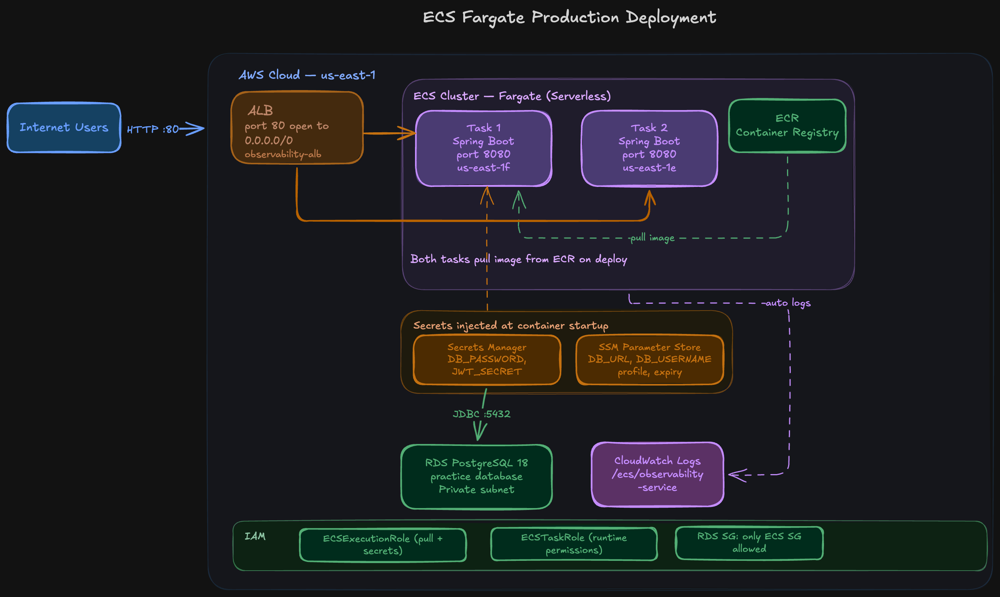

# Observability Service — AWS ECS Fargate Deployment


A production-grade Spring Boot application deployed on AWS ECS Fargate with a full cloud-native stack including secrets management, private database, load balancing, and container observability.

---

## Architecture Overview

```
Internet Users
      │
      ▼
Application Load Balancer (port 80)
      │
      ▼
ECS Cluster — Fargate (2 tasks across availability zones)
      │                        │
      ▼                        ▼
Spring Boot Container    Spring Boot Container
      (port 8080)              (port 8080)
      │
      ├──── RDS PostgreSQL (private subnet)
      │
      └──── CloudWatch Logs (/ecs/observability-service)

Secrets and Config (injected at container startup):
  ├── AWS Secrets Manager  → DB_PASSWORD, JWT_SECRET
  └── SSM Parameter Store  → DB_URL, DB_USERNAME, SPRING_PROFILES_ACTIVE, token expiry values

IAM:
  ├── ECS Execution Role   → pulls image from ECR, reads secrets at startup
  └── ECS Task Role        → app runtime permissions (CloudWatch)
```

---

## Architecture diagram



## Services Used

| Service | Purpose |
|---|---|
| Amazon ECR | Private container registry — stores Docker image |
| Amazon ECS Fargate | Serverless container runtime — no EC2 to manage |
| Application Load Balancer | Internet-facing entry point, health checking, multi-AZ routing |
| Amazon RDS (PostgreSQL 18) | Managed relational database in a private subnet |
| AWS Secrets Manager | Stores sensitive values: DB password, JWT secret |
| AWS SSM Parameter Store | Stores non-sensitive config: DB URL, username, profiles |
| AWS IAM | Execution role (ECS infra) and Task role (app runtime) |
| Amazon CloudWatch | Automatic container log aggregation |

---

## Key Architecture Decisions

### IAM Roles — Two Separate Roles, Not One

ECS requires two distinct IAM roles and conflating them is a common mistake:

- **Execution Role** — used by the ECS control plane to pull the image from ECR and fetch secrets from Secrets Manager and SSM before the container starts. The app never touches this role.
- **Task Role** — used by the running application code to call AWS services at runtime (e.g. write to CloudWatch).

Giving both responsibilities to one role violates the principle of least privilege.

### Secrets Manager vs SSM Parameter Store

Sensitive values (database password, JWT secret) go in **Secrets Manager** — encrypted at rest, audited, with automatic rotation support. Non-sensitive configuration (database URL, Spring profile, token expiry) goes in **SSM Parameter Store** — cheaper, simpler, still injected securely at startup.

Neither value ever appears in a Dockerfile, environment variable in source code, or task definition JSON checked into version control.

### Private RDS with Security Group Layering

RDS is deployed with public access disabled. The security group chain is:

```
0.0.0.0/0 → ALB SG (port 80)
ALB SG    → ECS SG (port 8080)
ECS SG    → RDS SG (port 5432)
```

Nothing reaches the database except the ECS tasks. Nothing reaches the ECS tasks except the ALB. The only public entry point is port 80 on the ALB.

### Fargate over EC2 Launch Type

Fargate eliminates the need to manage EC2 instances, patch operating systems, or right-size clusters. Each task declares its own CPU and memory. Scaling is per-task, not per-instance. For a service at this scale it removes an entire operational layer.

### Health Check Grace Period

Set to 0 seconds — the app must pass the ALB health check (`/actuator/health`) before being considered healthy. Spring Boot Actuator exposes this endpoint, and Redis health was excluded from the aggregate status (`MANAGEMENT_HEALTH_REDIS_ENABLED=false`) since no Redis instance is provisioned in this environment.

---

## Environment Variables — Injection Strategy

All environment variables are injected by ECS at task startup. None are hardcoded in the image.

| Variable | Source | Type |
|---|---|---|
| `DB_URL` | SSM Parameter Store | String |
| `DB_USERNAME` | SSM Parameter Store | String |
| `DB_PASSWORD` | Secrets Manager | SecureString |
| `JWT_SECRET` | Secrets Manager | SecureString |
| `SPRING_PROFILES_ACTIVE` | SSM Parameter Store | String |
| `ACCESS_EXPIRATION_MS` | SSM Parameter Store | String |
| `REFRESH_EXPIRATION_MS` | SSM Parameter Store | String |
| `MANAGEMENT_HEALTH_REDIS_ENABLED` | Task Definition (plain) | String |

---

## Deployment Steps (Manual — CI/CD in progress)

```bash
# 1. Authenticate Docker to ECR
aws ecr get-login-password --region us-east-1 | \
  docker login --username AWS --password-stdin \
  ACCOUNT_ID.dkr.ecr.us-east-1.amazonaws.com

# 2. Pull existing image from Docker Hub
docker pull technura/observability-service:latest

# 3. Tag for ECR
docker tag technura/observability-service:latest \
  ACCOUNT_ID.dkr.ecr.us-east-1.amazonaws.com/observability-service:latest

# 4. Push to ECR
docker push \
  ACCOUNT_ID.dkr.ecr.us-east-1.amazonaws.com/observability-service:latest

# 5. Force ECS to redeploy with new image
# ECS → observability-service → Update service → Force new deployment
```

---

## Health Check

```bash
curl http://observability-alb-889506611.us-east-1.elb.amazonaws.com/actuator/health
# {"groups":["liveness","readiness"],"status":"UP"}
```

---

## Challenges Encountered and How They Were Solved

This deployment was built from scratch on a brand new AWS account. Every problem below was real, debugged live, and resolved.

---

### Challenge 1 — ECS Service Linked Role Missing

**Error:**
```
CreateCluster Invalid Request: Unable to assume the service linked role.
```

**Root cause:** Brand new AWS accounts do not automatically create the `AWSServiceRoleForECS` role. It is normally bootstrapped on first ECS usage via the console wizard, but a CloudFormation-backed cluster creation path hit this before the role existed.

**Fix:**
```bash
aws iam create-service-linked-role --aws-service-name ecs.amazonaws.com
```

**Lesson:** Service linked roles are account-level, created once. They differ from regular IAM roles — you don't attach policies to them, AWS manages them entirely.

---

### Challenge 2 — JDBC URL Not Starting with "jdbc"

**Error:**
```
java.lang.IllegalArgumentException: 'url' must start with "jdbc"
```

**Root cause:** The SSM parameter `/observability/db_url` was set to the raw RDS hostname without the JDBC prefix. The ECS task definition was injecting this raw value into `DB_URL`, which Spring Boot's HikariCP datasource rejected.

**Fix:** Update the SSM parameter value to:
```
jdbc:postgresql://observability-db.xxxx.us-east-1.rds.amazonaws.com:5432/practice
```

**Lesson:** SSM stores exactly what you put in. There is no magic prefix injection. The full connection string including protocol must be stored.

---

### Challenge 3 — Environment Variable Name Mismatch

**Error:** Same JDBC error persisting after SSM fix.

**Root cause:** The ECS task definition was injecting `SPRING_DATASOURCE_URL` but the application's `application.yml` was reading `${DB_URL}`. The variable existed in the environment but under a different name — Spring Boot received it and silently ignored it, falling back to an empty value.

**Fix:** Create a new task definition revision renaming all environment variable keys to match exactly what the application expects (`DB_URL`, `DB_USERNAME`, `DB_PASSWORD`).

**Lesson:** ECS injects whatever key you specify. There is no automatic mapping between AWS parameter names and Spring Boot property names. The key in the task definition must exactly match the `${VARIABLE_NAME}` in `application.yml`.

---

### Challenge 4 — RDS Connection Timeout

**Error:**
```
java.net.SocketTimeoutException: Connect timed out
```

**Root cause:** The RDS security group had no inbound rule allowing connections from the ECS tasks. Even though both RDS and ECS were in the same VPC, the default security group behaviour is deny-all inbound.

**Fix:** Add an inbound rule to the RDS security group:
- Type: PostgreSQL (port 5432)
- Source: ECS tasks security group ID (`sg-091424c4debce7a5a`)

**Lesson:** Being in the same VPC does not mean services can talk to each other. Every security group defaults to deny-all inbound. Each service-to-service connection requires an explicit rule scoped to the source security group, not an IP range.

---

### Challenge 5 — Database Does Not Exist

**Error:**
```
org.postgresql.util.PSQLException: FATAL: database "practice" does not exist
```

**Root cause:** RDS PostgreSQL only creates the default `postgres` database on provisioning. The application expected a database named `practice` which had never been created.

**Fix:** Launch a temporary EC2 bastion host in the same VPC, install the PostgreSQL client, connect to RDS through it, and run:
```sql
CREATE DATABASE practice;
```
Then terminate the bastion immediately.

**Lesson:** RDS does not create application databases automatically. The master user and default database are created, but any application-specific database must be created manually or via a migration tool on first deploy. A bastion host is the standard pattern for accessing private databases without exposing them to the internet.

---

### Challenge 6 — ALB Health Check Reporting DOWN

**Error:** Tasks running but ALB showing 2 Unhealthy targets. Deployment circuit breaker triggering rollback.

**Root cause:** Spring Boot Actuator's `/actuator/health` endpoint was returning `DOWN` because the Redis health indicator was included in the aggregate status. Redis was not provisioned in this environment, so every health check request returned an overall status of `DOWN`, causing the ALB to mark both targets unhealthy and trigger a deployment rollback.

**Fix:** Add to ECS task definition environment variables:
```
MANAGEMENT_HEALTH_REDIS_ENABLED=false
```

This excludes Redis from Spring Boot's health aggregation without modifying the application code.

**Lesson:** Spring Boot Actuator aggregates all registered health indicators. If any dependency is unavailable (Redis, a downstream API, a message broker), the whole health endpoint returns DOWN — which is correct behaviour for production but requires explicitly excluding components that are intentionally not present in an environment.

---

### Challenge 7 — ALB Timeout from the Internet

**Error:**
```
curl: (28) Failed to connect to observability-alb-... port 80 after 300327 ms
```

**Root cause:** The ALB security group had no inbound rule for port 80 from the internet. All previous security group work had been on the ECS task security group and the RDS security group. The ALB itself has its own security group which also defaults to deny-all inbound.

**Fix:** Add to the ALB security group:
- Type: HTTP (port 80)
- Source: Anywhere-IPv4 (0.0.0.0/0)

**Lesson:** Every component in the chain — ALB, ECS tasks, RDS — has its own security group. Fixing one does not fix the others. The mental model is: draw the request path from internet to database, then verify every security group boundary along that path has an explicit allow rule.

---

## What Would Break at Scale

| Current Setup | Problem at Scale | Fix |
|---|---|---|
| 2 Fargate tasks (fixed) | Cannot handle traffic spikes | ECS Service Auto Scaling on CPU/request metrics |
| Manual deployment via console | Slow, error-prone, no auditability | CI/CD pipeline (CodePipeline + CodeBuild) — next |
| Redis hardcoded to localhost | Caching disabled entirely | ElastiCache Redis in same VPC |
| No HTTPS | Data in transit unencrypted | ACM certificate + ALB HTTPS listener (port 443) |
| Single RDS instance | Single point of failure for data | RDS Multi-AZ with automatic failover |
| Health check grace period 0 | Slow-starting tasks fail health check | Set grace period to 60–120 seconds |
| Secrets Manager secrets static | Credentials never rotated | Enable automatic rotation on Secrets Manager secrets |

---

## Next Steps

- **Project 6:** CI/CD pipeline with CodePipeline + CodeBuild — push to GitHub triggers automatic build, ECR push, and ECS rolling deploy
- **ElastiCache Redis:** Provision a Redis cluster for session/cache support
- **HTTPS:** Add ACM certificate and redirect HTTP to HTTPS on the ALB
- **Auto Scaling:** ECS Service Auto Scaling based on CPU and ALB request count